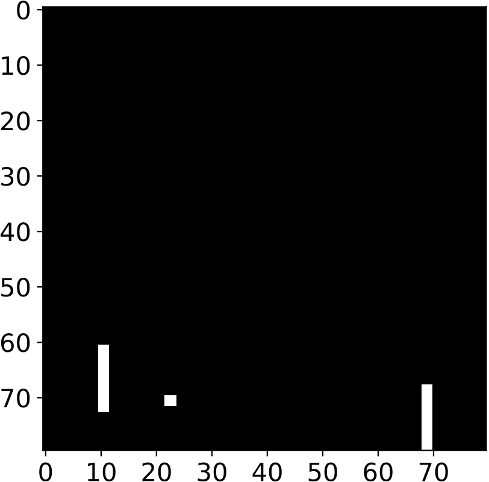
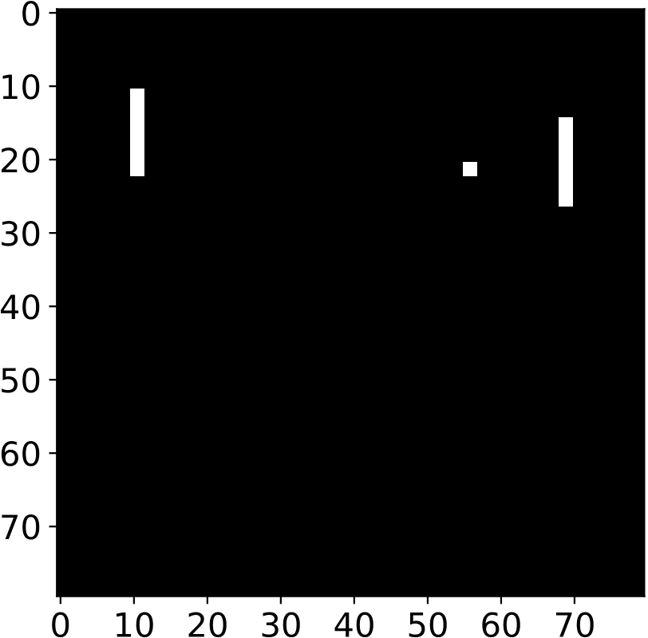
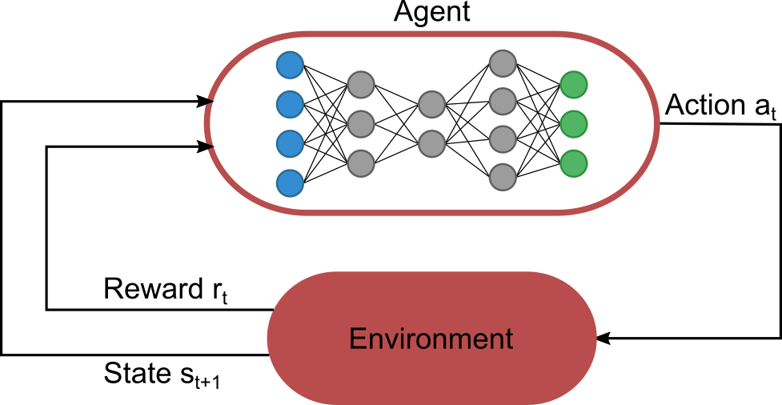
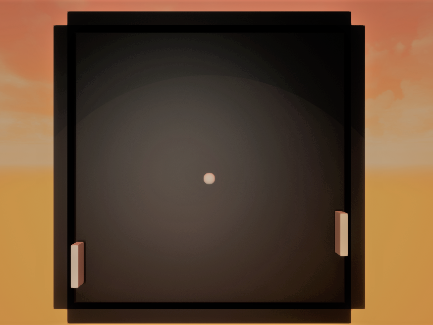
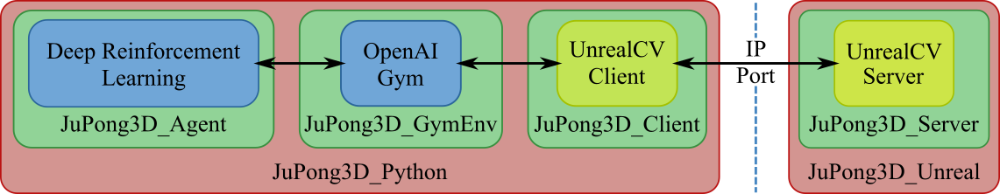

# Deep Reinforcement Library for the ATARI Videogame Pong in 2D and 3D

## Table of Contents

[[_TOC_]]

## Introduction

### ATARI Pong

Pong is a video game, which was developed by ATARI in 1972. It is one of the most famous video games in the world and was also the founder of the whole gaming scene. The game rules are really simple, building on table tennis. You have two players and each of them controls a paddle in a quadratic interface. There is also a ball, which can move in a horizontal and in a vertical direction. The paddles can only move up and down. The aim of the game is to hit the ball more often with the controlled paddle than the enemy, so you can score more points than him.    

**Graphical interface of Pong**  

### What is this project doing with Pong?

This project provides a basic Deep Reinforcement Learning library by using the libraries RLlib and Stable Baselines within Pong. It trains one of the paddles with different Deep Reinforcement Learning algorithms and neuronal networks to master the game. RLlib and Stable Baselines are Python-Frameworks, which make the usage of such algorithms and neuronal networks much easier.

### A quick introduction to Deep Reinforcement Learning

Deep Reinforcement Learning uses principles to create efficient algorithms applied on areas like robotics, video games, computer science, computer vision, education, transportation, finance and healthcare. The main goal of this topic is to create an Artificial General Intelligence (AGI), that has the capacity to understand or learn any intellectual task that a human being can. A good example in the real world is autonomous driving. 

The figure below explains the key concepts of Deep Reinforcement Learning. On the one hand you have an agent which lives in an environment and can execute one of many actions a_t per timestep. On the other hand you have an environment that will change its state depending on the last action of the agent. It creates a state s_t of the current frame for the agent and evaluates his last action with a reward r_t. The agent uses the current state from the environment to calculate the action of the next timestep. For this the agent has a neuronal network which takes a state as input and returns a probability distribution for the next action. After a specific amount of timesteps all the generated actions, states and rewards will be collected to train the neuronal network of the agent.  

**Key Concepts of Deep Reinforcement Learning**  

### Using Supercomputers

Sometimes the training of neuronal networks can be really expensive in relation to the number of computations. If possible, Supercomputers can reduce the effort by a lot. In this project I used a Supercomputer called JUWELS from the Forschungszentrum Jülich in Germany (you can read more information here: https://www.fz-juelich.de/ias/jsc/EN/Expertise/Supercomputers/JUWELS/JUWELS_node.html). It helps you to train a neuronal network in less than a day, compared to a normal PC, which can take multiple days or even weeks to achieve just as good training results. If you are a JUWELS-User, you can directly test the Deep Reinforcement Learning libraries by using one of the Jupyter-Notebooks, which I've written for this case. If you don't have access to any Supercomputer, it's no problem, you can still run your tests on your local machine. 

## Deployment of the Unreal Engine  

Training an AI to drive a car by itself is a hard challenge in the real world. The internal neuronal network needs a lot of training data to achieve good driving results. A huge problem here is that the neuronal network needs to know what a bad decision during the training looks like. That means it has to discover situations where the driven car could crash or where other people could be in danger, so it can avoid that types of wrong decisions when it is completely trained. You need a lot of this bad data to make the network more stable, but this is extremely expensive if you do this in the real world. 

At this point a new solution has to be found. In this project the Unreal Engine 4 from Epic Games was used to train a neuronal network with Deep Reinforcement Learning algorithms in a 3D-Gym-Environment. The Engine was responsible for getting and creating training data. In the case of Pong the datasets were transformed images from the Graphical Unreal Engine Interface (see image below, this is how the Gym-Environment JuPong3D looks like).

**JuPong3D inside the Unreal Engine**  

An important task to do is to link the Unreal Engine with OpenAI Gym to train the 3D-Game with Deep Reinforcement Learning algorithms. Therefor a plugin named UnrealCV was used for the Unreal Engine on the one hand and on the other hand for the Gym-Environment JuPong3D which was implemented in Python. The figure below describes how the linkage between the Unreal Engine and OpenAI Gym is achieved. 

**Linkage of the Unreal Engine with OpenAI Gym and Deep Reinforcement Learning**

When you start an agent, which will be trained with a Deep RL algorithm, it automatically starts the Gym-Environment JuPong3D. This in turn will start the Game Pong3D from the Unreal Engine, which automatically creates an UnrealCV-Server. The server listens to an IP-adress and Port. The UnrealCV-Client, who is created by the Gym-Environment, can connect to it by entering the right IP-adress and the Port of the running application. After this process the Gym-Environment can be used to execute actions and recieve states and rewards from the Unreal Engine. In the case of Pong the UnrealCV-Plugin was used to create custom commands to move the paddle of the agent up and down. The states will be created from a camera view inside the Unreal Engine, which returns an image after executing a specific UnrealCV-Command.

## What do we have now?

Here you can see the file- and folder-structure of this project:

- ci (Contains several bash scripts for continuous integration in Git)
- images (Images for the README.md)
- lib (Important libraries for the Gym-Environments JuPong2D and JuPong3D and a place for the virtual Python environment)
    - UnrealCV
    - jupong
- results (Here you can see training and test results if you for example execute the Jupyter Notebooks rllib_test.ipynb and stablebl_test.ipynb)
- scripts (Some python and bash scripts)
- src (Source folder where different Python scripts are written to test the Gym-Environments JuPong2D and JuPong3D with different Deep Reinforcement Learning algorithms and libraries)
    - deeprl_lib
        - nolib
        - rllib
        - stablebaselines
    - setup.py
- tests (Folder to make different tests in this project like Unit Testing)
- .gitignore
- .gitlab-ci.yml (YAML-file for continuous integration)
- README.md
- directories.txt (The directories in this file will be checked during the CI-process)
- install_juwels.sh (Installation-file of this project for JUWELS-Users. It basically creates a virtual Python environment)
- install_windows.sh (Installation-file of this project for Windows-Users. It basically creates a virtual Python environment)
- requirements.txt (List of necessary Python-libraries)
- rllib_juwels_test.ipynb (Test Notebook for the library RLlib if you are on JUWELS or a similar Supercomputer)
- rllib_local_test_bash.ipynb (Test Notebook for the library RLlib if you are on a local machine and a bash kernel is running)
- rllib_local_test_python.ipynb (Test Notebook for the library RLlib if you are on a local machine and a Python kernel is running)
- stablebl_juwels_test.ipynb (Test Notebook for the library Stable Baselines if you are on JUWELS or a similar Supercomputer)
- stablebl_local_test_bash.ipynb (Test Notebook for the library Stable Baselines if you are on a local machine and a bash kernel is running)
- uninstall.sh (Removes the virtual Python environment)

## Download and install the project

You can download the project by using 

> git clone https://gitlab.version.fz-juelich.de/azzam1/pong_deeprl.git

**or** downloading the zip-file from this link: https://gitlab.version.fz-juelich.de/azzam1/pong_deeprl/-/archive/master/pong_deeprl-master.zip 

After that the installation process begins. I recommend you to create a virtual Python environment using the command

> python -m venv /path/to/venv

It allows you to avoid installing Python packages globally which could break system tools or other projects. When you are inside the virtual 
environment (source [...]/activate) go to the **root folder** of this project and execute the command

> pip install -e .

to install the project from the src-folder and then enter the command

> pip install -r requirements.txt

which will install all necessary libraries to use this project.

### Before the test

Before you can run the Jupyter-Notebooks as a first test, you need to create the right **Jupyter Kernels** for that. Some Notebooks need a Python-Kernel and some are using a Bash-Kernel. The link https://janakiev.com/blog/jupyter-virtual-envs/ tells you how to add a Virtual Python Environment to Jupyter Notebooks.

## Preparing the Gym-Environment JuPong3D

To run a neuronal network inside of a Unreal Engine Gym-Environment, you first need to download the right Unreal Engine Application of Pong3D, which uses the UnrealCV-Plugin. You can find it under the following link: https://gitlab.version.fz-juelich.de/azzam1/pong3d_app . It's a Git-Repository which you can simply clone or download as Zip-File. It contains a Unreal Engine Application for Windows (**WindowsNoEditor**) and for Linux (**LinuxNoEditor**). 

After you downloaded the Repository, you need to go to the **UnrealEnv**-Folder of this project, which you can find under the path **[...]/pong_deeprl/lib/UnrealCV/gym-unrealcv/gym_unrealcv/envs/UnrealEnv**. Depending on your operating system create a folder named **RealisticRendering_LinuxX86_64** (for Linux) or **RealisticRendering_Win64** (for Windows) inside of the **UnrealEnv**-Folder. After that put the right Unreal-Application-Folder in the created folder. That means, copy the **LinuxNoEditor**-Folder inside the **RealisticRendering_LinuxX86_64**-Folder when you're using Linux or copy the **WindowsNoEditor**-Folder inside the **RealisticRendering_Win64**-Folder when you're using Windows.

## Testing the Gym-Environment JuPong2D

### Full test of the RLlib-Library

After running the installation on JUWELS or on a local machine you can test the RLlib-library by running the Jupyter Notebook **rllib_juwels_test.ipynb** on JUWELS or the Notebooks **rllib_local_test_bash.ipynb** and/or **rllib_local_test_python.ipynb** on your local machine. In principle they are divided into 4 steps:

1) Loading the virtual Python environment by activating or importing all necessary libraries

2) Training a neuronal network in the Gym-Environment JuPong2D with a Deep Reinforcement Learning algorithm (f.e. Proximal Policy Optimization)

3) Testing the trained model in different Gym-Environments, which depend on the parameters (here: Paddle Length)

4) Plotting the training and testing results

### Full test of the Stable Baselines Library

After running the installation on JUWELS or on a local machine you can test the Stable Baselines library by running the Jupyter Notebook **stablebl_juwels_test.ipynb** on JUWELS or the Notebook **stablebl_local_test_bash.ipynb** on your local machine. They are also divided into 4 steps:

1) Loading the virtual Python environment

2) Training a neuronal network in the Gym-Environment JuPong2D

3) Testing the trained model in different Gym-Environments, which depend on different parameters (here: Paddle Length, Paddle Speed and Ball Speed)

4) Plotting the training and testing results

## What role are you playing as user?

This project provides a really basic and simple examples of using Deep Reinforcement Learning algorithms and libraries within two simple Gym-Environments in 2D and in 3D. The Unreal Engine helps to train neuronal networks in more complex environments by combining it with OpenAI Gym using the UnrealCV plugin.

With the Jupyter-Notebooks I am trying to explain the basic usage of DeepRL and OpenAI Gym in the simplest way, so you can use it as a basic toolset if you want to create your own Gym-Environments and train them with different algorithms.  